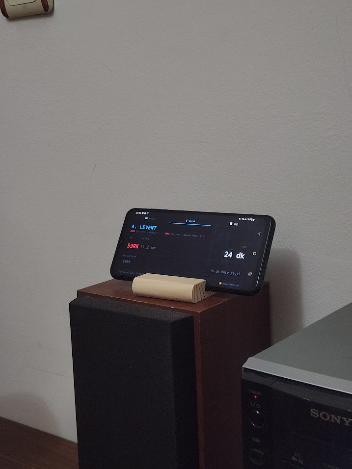

# iett_takip
Boğaziçi Üniversitesine giden 59RK ve 59RS otobüslerinin 4. Levent'e ne kadar sürede varacağını gerçek zamanlı olarak gösteren uygulama. Localhost üzerinden aynı ağdaki tüm tarayıcılar tarafından erişilebilir.

Otobüs konum verisi İBB İETT otobüs konum API'ından çekiliyor olup Google Maps Matrix Api üzerinden gelen trafik verisi eklenerek 2dk'da bir kalan süreyi hesaplar.  

Pano Ekranı:

Canlı Harita:

Ev İçi Kullanım:

